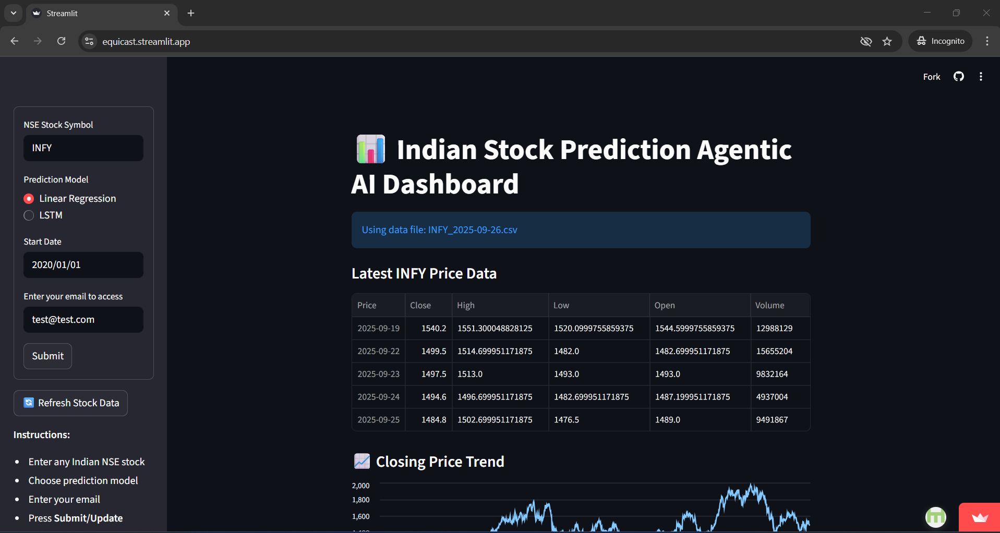

Indian Stock Prediction Agentic AI
A production-ready, agentic AI tool and dashboard for real-time Indian stock analysis, built in Python and Streamlit.
It fetches, predicts, visualizes, and simulates Buy/Sell/Hold decisions for any NSE stock—empowering investors, analysts, and learners with data-driven, actionable insights.

🚀 Features
Automatic Data Fetch: Download real NSE stock data instantly—only the latest data, no manual refresh.

Model Switch: Choose between Linear Regression and LSTM (Advanced) models for next-closing-price prediction.

Technical Indicators: SMA-20, RSI charts alongside price for multidimensional analysis.

Agentic Decisions: AI recommends Buy/Sell/Hold daily, with clear rationale.

Portfolio Backtesting: See how well you’d perform by following AI decisions.

Mobile Friendly: All controls use buttons/forms, no Enter required.

User Authentication: Restricts access to authorized emails only.

Modular Codebase: Clean folders for data, models, agents, and reusability.

📷 Demo Screenshots

🗂️ Folder Structure
text
project-root/
├── src/
│   ├── app/
│   │   └── dashboard.py
│   ├── data/
│   │   └── fetch_data.py
│   ├── models/
│   │   ├── linear_model.py
│   │   └── lstm_model.py
│   ├── agent/
│   │   ├── decision_engine.py
│   │   └── backtest.py
│   └── utils/
│       └── paths.py
├── data/
│   ├── raw/
│   └── predictions/
├── requirements.txt
├── README.md
🏁 Quickstart (Local)
Clone Repo

bash
git clone https://github.com/<your-username>/<your-repo>.git
cd <your-repo>
Install Requirements

bash
pip install -r requirements.txt
Start the App

bash
streamlit run src/app/dashboard.py
🤳 Try in your mobile browser—the design is mobile friendly!

🌐 Deployment (Streamlit Cloud)
Push to GitHub as shown above.

Go to Streamlit Cloud and “New app”.

Choose your repo and set src/app/dashboard.py as the entry point.

Add secrets or set environment variables if your email whitelisting requires.

Share your deployed URL with your organization (restricted by email!).

✨ Example Usage
Enter “INFY” or any NSE ticker in the sidebar, set your analysis model, update your email, and tap Submit.

Press Refresh Stock Data if it’s your first use or when checking a new day.

Explore the dashboard: price trends, technicals, predictions, agent decisions, and simulated profit/loss!

⚡ How It Works
Data Layer: Uses yfinance to pull raw stock data, saves as daily CSV to avoid excess downloads.

Model Layer: Linear Regression uses scikit-learn; LSTM uses Keras/TensorFlow (precomputed for speed).

Agent Layer: Rule-based engine selects Buy/Sell/Hold, auto-backtests on past actuals.

UI Layer: Streamlit provides all dashboarding and mobile controls.

Security: Only whitelisted emails granted access.

🧠 Business Value
Reduces manual, subjective stock analysis.

Empowers users to test their strategies virtually before committing cash.

Ready to scale with more models, more features, or integration to real trading APIs.

📝 Customization & Extensibility
Add more technical indicators using the ta library.

Plug in your custom models into the models/ folder.

Refine agent logic to use more sophisticated rules or ensemble methods.

UI customizable via Streamlit’s theming tools.

🤝 Credits
yfinance

scikit-learn

TensorFlow/Keras

Streamlit

ta

Built by Your Name

❓ FAQ
Why is my data not updating?
Press “Refresh Stock Data” or check your ticker name.

Can I use this for US stocks?
Yes, with slight code tweaks (yfinance symbols for US).

Can I add more users?
Edit the ALLOWED_EMAILS list.

Can I run my own models?
Absolutely! Drop your scripts in models/ and call as needed.

📬 Contact
For questions or collaborations, email (nikhil@nikhilagarwal.co.in) or connect on LinkedIn!
Website - https://www.nikhilagarwal.co.in/p/contact-us.html

Ready to revolutionize your stock research? Fork, star, and try it out! 🚀

